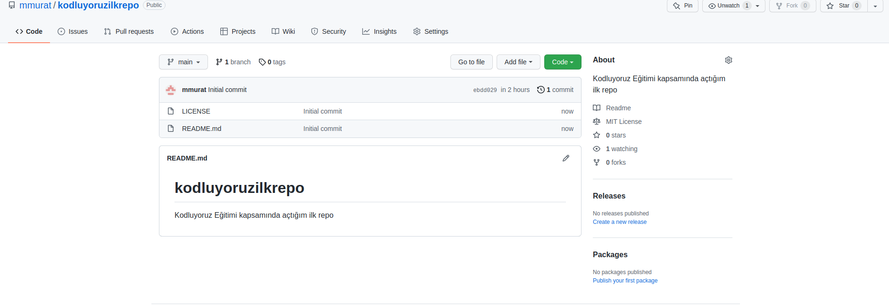

# Kodluyoruz Ilk Repo

Bu repo [Kodluyoruz](http//www.kodluyoruz.org) Front-End Eğitiminde oluşturduğumuz ilk repo. İçerisinde bir adet README dosyası, bir adet index.html barındırıyor.

## Installation 


Öncelikle projeyi klonlayın. [http://www.github.com/mmurat/kodluyoruzilkrepo](http://www.github.com/mmurat/kodluyoruzilkrepo)

```
    git clone http://www.github.com/mmurat/kodluyoruzilkrepo.git
```

## Usage

Programı klonladıltan sonra Visial Studio Code programını açınız.

Linux için:

```
    cd kodluyoruzilkrepo
    code .
```

## Contributing 

Pull requestler kabul edilir. Büyük değişikler için, lütfen önce neyi değiştirmek istediğinizi tartışmak için bir konu açınız.

## Project



## License 

[MIT](https://opensource.org/licenses/MIT)


